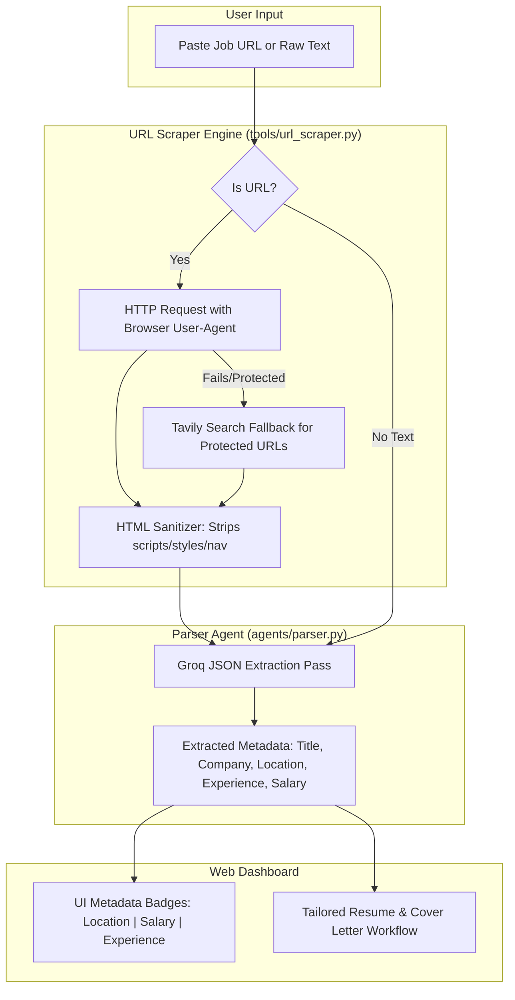

# Implementation Plan: Automatic Job URL Scraper

Implement **Automatic Job URL Parsing & Structured Metadata Extraction** in the **AI Career Agent**. This enables users to paste job URLs directly (from LinkedIn, Indeed, Lever, Greenhouse, Workday, etc.), automatically scraping clean posting content and extracting `job_title`, `company_name`, `location`, `experience_requirements`, and `salary_range`.

---

## 1. User Review Required

> [!IMPORTANT]
> - **Scraping Strategy**: Uses a hybrid scraper (`requests` with custom browser headers + Tavily search fallback for JavaScript-rendered sites).
> - **Metadata Extraction**: Extracts structured fields (`location`, `salary_range`, `experience_level`) alongside responsibilities and keywords.
> - **UI Experience**: Auto-detects URL input in real time and presents extracted metadata badges in the results header.

---

## 2. Architecture & Workflow

---

## 3. Proposed Changes

### Tools & Scraping Engine

#### [NEW] [url_scraper.py](file:///c:/Users/kavyagada/Downloads/Job-Application-Agent/tools/url_scraper.py)
- Implements `is_valid_url(text)`.
- Implements `scrape_job_url(url)`:
  - Uses `requests` with Chrome User-Agent and headers.
  - Strips non-content HTML elements (`<script>`, `<style>`, `<nav>`, `<footer>`, `<header>`).
  - Fallbacks to Tavily search context extraction if site blocks direct HTTP requests.

---

### Prompts & Parser Agent

#### [MODIFY] [parse_prompt.txt](file:///c:/Users/kavyagada/Downloads/Job-Application-Agent/prompts/parse_prompt.txt)
- Update JSON schema to require:
  - `company_name`
  - `job_title`
  - `location` (e.g., "Remote", "New York, NY", "Bangalore, India")
  - `experience_requirements` (e.g., "3+ years", "Entry level")
  - `salary_range` (e.g., "$120,000 - $150,000" or "Not specified")
  - `keywords`
  - `responsibilities`

#### [MODIFY] [parser.py](file:///c:/Users/kavyagada/Downloads/Job-Application-Agent/agents/parser.py)
- Integrate `tools.url_scraper.scrape_job_url` when `jd_input` is a URL.
- Process cleaned text through Groq JSON extraction pass.

---

### Backend API & Frontend UI

#### [MODIFY] [web.py](file:///c:/Users/kavyagada/Downloads/Job-Application-Agent/web.py)
- Include extracted metadata (`location`, `experience_requirements`, `salary_range`) in `/process` JSON response.

#### [MODIFY] [index.html](file:///c:/Users/kavyagada/Downloads/Job-Application-Agent/templates/index.html)
- Add metadata display container in results banner (`#jobMetadataContainer`).

#### [MODIFY] [script.js](file:///c:/Users/kavyagada/Downloads/Job-Application-Agent/static/script.js)
- Add real-time URL detection indicator on `#jd_text` input.
- Render metadata badges (**📍 Location**, **💼 Experience**, **💰 Salary**) in results banner.

---

## 4. Verification Plan

### Automated & Unit Verification
- Run test script with sample URLs (e.g., Greenhouse/Lever job link, LinkedIn public link, raw text).
- Verify extracted JSON contains `location`, `salary_range`, and `experience_requirements`.

### Web UI Verification
- Paste a job URL in `#jd_text`.
- Click **Generate Application & Interview Suite**.
- Verify metadata badges appear in the results banner alongside download links.
